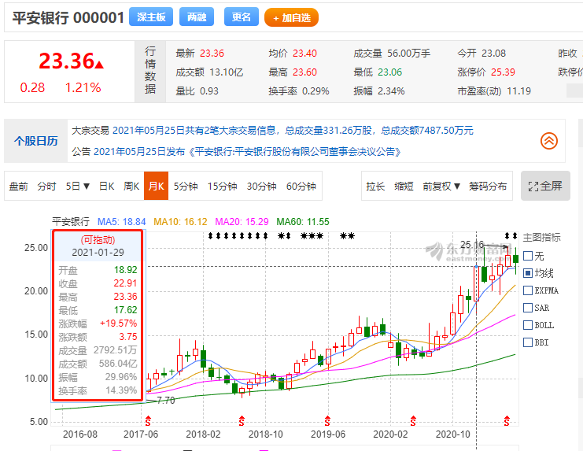

# 2-7 【作业】resample函数的应用-简答题
## 第一题
```py
# 设置行列不忽略
pd.set_option('display.max_rows',100000)
pd.set_option('display.max_columns',10)

# 转换周期：日K转换为周K
# df = get_price('000001.XSHE',count=10,end_date='2021-06-26', frequency='daily',panel=False) # 获取日K
df = get_price('000001.XSHE',start_date='2021-01-01',end_date='2021-01-31', frequency='daily',panel=False) # 获取日K
df['weekday']=df.index.weekday

print(df)

# 获取周K（当周的）：开盘价（当周第一天）、收盘价（当周最后一天）、最高价（当周）、最低价（当周）
df_week=pd.DataFrame()
df_week['开盘']=df['open'].resample('M').first() # open 周k W 月k M
df_week['收盘']=df['close'].resample('M').last() # close
df_week['最高']=df['high'].resample('M').max() # high
df_week['最低']=df['low'].resample('M').min() # low

# 汇总统计：统计一下月成交量、成交额（sum）
df_week['成交量']=df['volume'].resample('M').sum() # volume(sum)
df_week['成交额']=df['money'].resample('M').sum() # money(sum)
print(df_week)
```
打印内容
```md
auth success 
             open  close   high    low       volume         money  weekday
2021-01-04  18.95  18.45  18.95  18.30  156643831.0  2.891682e+09        0
2021-01-05  18.26  18.03  18.34  17.66  183567466.0  3.284607e+09        1
2021-01-06  17.94  19.41  19.41  17.86  195016094.0  3.648522e+09        2
2021-01-07  19.37  19.74  19.82  19.08  159664285.0  3.111275e+09        3
2021-01-08  19.74  19.70  19.94  19.16  120487406.0  2.348316e+09        4
2021-01-11  19.84  20.22  20.48  19.84  180453675.0  3.652547e+09        0
2021-01-12  20.23  20.84  20.84  20.02  129829524.0  2.657687e+09        1
2021-01-13  20.84  20.54  20.85  20.24  105736969.0  2.161850e+09        2
2021-01-14  20.52  20.01  20.73  19.79  113904282.0  2.306405e+09        3
2021-01-15  20.84  20.84  21.78  20.66  250019636.0  5.311218e+09        4
2021-01-18  21.03  22.52  22.60  21.03  217426614.0  4.792909e+09        0
2021-01-19  22.33  22.17  22.66  21.88  125185574.0  2.790057e+09        1
2021-01-20  21.98  22.29  22.79  21.95  129086493.0  2.889250e+09        2
2021-01-21  22.32  22.06  22.62  21.98   95220805.0  2.114253e+09        3
2021-01-22  22.06  21.86  22.06  21.34   93170389.0  2.025835e+09        4
2021-01-25  21.55  22.31  22.42  21.26  103645202.0  2.269033e+09        0
2021-01-26  22.13  22.20  23.14  22.13  113558074.0  2.558576e+09        1
2021-01-27  22.14  22.90  23.29  22.14  130432954.0  2.976801e+09        2
2021-01-28  22.60  22.63  23.00  22.27   86421990.0  1.948881e+09        3
2021-01-29  22.63  22.91  23.36  22.53  125001142.0  2.864101e+09        4
             开盘    收盘    最高    最低      成交量         成交额
2021-01-31  18.95  22.91  23.36  17.66  2.814472e+09  5.860380e+10

Process finished with exit code 0
```

参考[网站](http://quote.eastmoney.com/concept/sz000001.html)



---

## 第二题
```py
# 设置行列不忽略
pd.set_option('display.max_rows',100000)
pd.set_option('display.max_columns',10)

# 转换周期：日K转换为周K
# df = get_price('000001.XSHE',count=10,end_date='2021-06-26', frequency='daily',panel=False) # 获取日K
df = get_price('000001.XSHE',start_date='2020-01-01',end_date='2020-12-31', frequency='daily',panel=False) # 获取日K
df['weekday']=df.index.weekday

print(df)

# 获取周K（当周的）：开盘价（当周第一天）、收盘价（当周最后一天）、最高价（当周）、最低价（当周）
df_week=pd.DataFrame()
df_week['开盘']=df['open'].resample('M').first() # open 周k W 月k M
df_week['收盘']=df['close'].resample('M').last() # close
df_week['最高']=df['high'].resample('M').max() # high
df_week['最低']=df['low'].resample('M').min() # low

# 汇总统计：统计一下月成交量、成交额（sum）
df_week['成交量']=df['volume'].resample('M').sum() # volume(sum)
df_week['成交额']=df['money'].resample('M').sum() # money(sum)
print(df_week)
```
打印内容
```md
            开盘    收盘    最高    最低      成交量         成交额
2020-01-31  16.24  15.16  16.91  15.01  1.520850e+09  2.466329e+10
2020-02-29  13.65  14.14  15.33  13.65  2.595982e+09  3.750110e+10
2020-03-31  14.19  12.49  15.26  11.62  2.725267e+09  3.669330e+10
2020-04-30  12.54  13.59  13.97  12.16  1.750160e+09  2.244271e+10
2020-05-31  13.42  12.90  13.78  12.45  1.244672e+09  1.631273e+10
2020-06-30  13.00  12.70  13.77  12.42  1.841689e+09  2.378542e+10
2020-07-31  12.69  13.24  16.50  12.64  4.845076e+09  6.941590e+10
2020-08-31  13.36  14.96  15.56  13.33  3.148977e+09  4.516316e+10
2020-09-30  14.84  15.05  15.96  14.49  2.168742e+09  3.292620e+10
2020-10-31  15.18  17.61  18.63  15.01  2.100316e+09  3.589953e+10
2020-11-30  17.51  19.59  20.72  16.56  2.073678e+09  3.779005e+10
2020-12-31  19.55  19.19  20.35  17.65  1.977047e+09  3.692006e+10
```

---